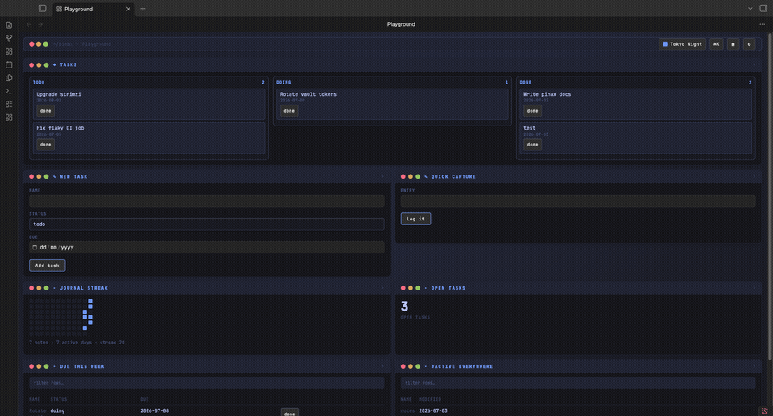
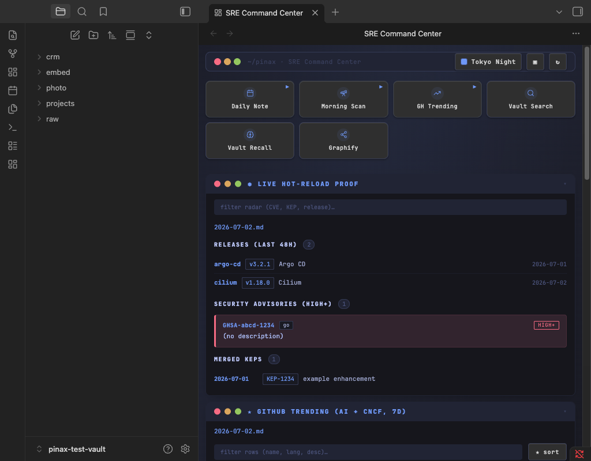
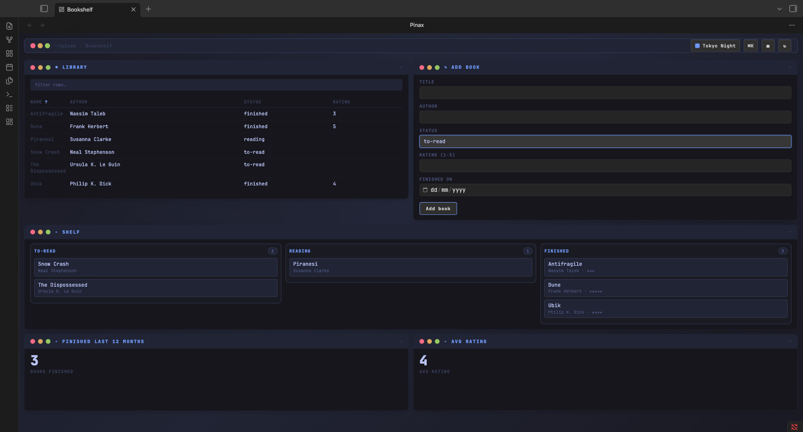
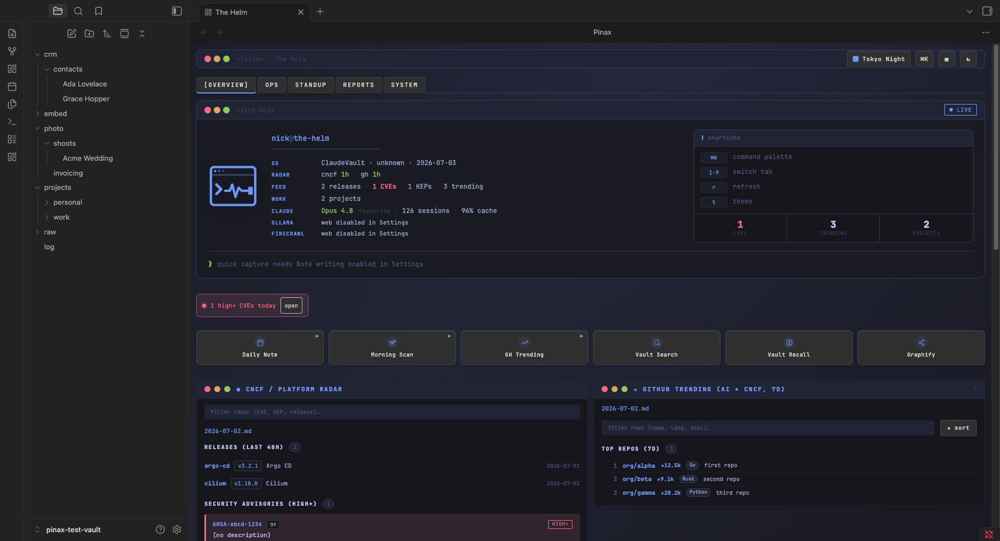

<h1><picture>
  <source media="(prefers-color-scheme: dark)" srcset="docs/wordmark-dark.svg">
  
</picture></h1>

<p>
  <a href="https://github.com/sphragis-oss/pinax/actions/workflows/ci.yml"></a>
  <a href="https://github.com/sphragis-oss/pinax/releases/latest"></a>
  <a href="LICENSE"></a>
</p>

**pinax** (πίναξ, an ancient board/panel - literally a dashboard) is a domain-agnostic, LLM-buildable dashboard framework for Obsidian. You describe the dashboard you want; a config file (`profile.json`) renders it on top of the notes you already have. No code, no rebuild, no assumptions about your vault.

The same codebase ships three profiles with zero code difference: an SRE command center, the full multi-tab "The Helm" dashboard it was seeded from, and a reading tracker. That is the point: pinax is a framework, not an app.



| SRE profile | Reading profile |
|---|---|
|  |  |



## How it works

- A **profile** = `profile.json` (layout + panes), stored at `.obsidian/plugins/pinax/profiles/<id>/`. Editing it (or its optional `widgets.js`) hot-reloads the dashboard. Profiles carry `"schemaVersion": 1` for forward migration.
- **11 built-in widget types**: `folder-latest`, `folder-list`, `markdown-embed`, `table` (notes-as-records via frontmatter, paginated, optional recursive), `form` (create a note, or append to one under a heading), `command-buttons` (copy + open terminal), `iframe`, `heatmap` (GitHub-style activity calendar with streaks and day click-through), `board` (records grouped by a frontmatter field; with write trust, dragging a card between columns rewrites its frontmatter, a real kanban), `stat` (one aggregated number, optional sparkline and warn thresholds), `custom`. Path fields accept `{{today}}`, rolling `{{today-7d}}` and `{{vaultName}}` tokens; record sources read a folder or a tag set and take a `where` frontmatter filter; `table`/`board` rows carry write-gated action buttons that rewrite frontmatter in place (close a task without opening it); any pane can auto-refresh with `refreshSec`. The dashboard is **live**: editing, creating, renaming or deleting a note that a pane displays re-renders it automatically (debounced), and every frontmatter mutation (action button, board drop) shows a notice with one-click **Undo**.
- A **public API** on `window.pinax` (apiVersion 1): `registerWidget`/`unregisterWidget`, safe vault helpers (`latestInFolder`, `listFolder`, `readNote`, `records`, `createNote`), `runCommand`. Custom widgets render in `custom` panes; unknown ids show a placeholder, never a crash. Widgets with timers return a cleanup function that Pinax runs on every re-render.
- **Profile-local widgets**: a profile folder may ship a `widgets.js` (see `examples/widgets-file-example.js`); Pinax executes it only after the user enables "Custom widget code" for that profile.
- **Trust boundary, per profile**: web embeds, command buttons, note writing, and custom widget code are four toggles, all OFF by default and scoped to a single profile - an imported profile never inherits trust you granted another. Command buttons only ever copy the command and open a terminal, never auto-execute. All config paths are validated to stay inside the vault.
- **LLM authoring**: `profile.schema.json` + [AUTHORING.md](AUTHORING.md) + the bundled [`build-your-pinax`](commands/build-your-pinax.md) Claude command interview a user in natural language and emit a valid, loadable profile.
- **Sharing**: export/import profiles as JSON bundles (including `widgets.js`) from Settings, by paste or from an https:// URL (URL fetch requires the active profile's Web embeds toggle). Community profiles live in [sphragis-oss/pinax-profiles](https://github.com/sphragis-oss/pinax-profiles).
- **18 themes**, all CSS-variable driven (press `t` in the dashboard; `⌘K` opens a command palette).
- **Deep links**: `obsidian://pinax?profile=<id>` opens the dashboard on that profile (runbooks, Raycast, shell aliases). First open with no active profile shows a profile picker; Settings has one-click profile duplication.

## Install

**BRAT (beta)**: install the [BRAT](https://github.com/TfTHacker/obsidian42-brat) community plugin, add this repo as a beta plugin, and BRAT pulls `main.js`/`manifest.json`/`styles.css` from the latest GitHub release.

**Manual**:

```bash
cd <vault>/.obsidian/plugins/pinax
npm install && npm run build
```

Enable community plugins in Obsidian, toggle **Pinax** on, then run **Pinax: Open dashboard** from the command palette or click the ribbon icon. On first load the bundled `sre`, `helm`, and `reading` profiles are materialized under `profiles/`; pick one in Settings → Pinax.

Optional companion: the **Terminal** community plugin (`polyipseity/obsidian-terminal`) so command buttons open an integrated terminal pane.

## Shipped profiles

| Profile | Proves | Data it reads |
|---|---|---|
| `sre` | No regression from the seed plugin (single page) | `raw/scans/*`, `raw/daily/`, `projects/` |
| `helm` | Full multi-tab parity: hero, alerts, ops, standup, reports, system | same + `~/.claude` session logs, local service probes |
| `reading` | Domain-agnosticism | a plain `reading/books/` folder |

The `helm` profile's service probes and usage panel are desktop-only and sit behind the web/command toggles; on mobile or while gated they degrade to placeholders.

## Development

```bash
npm run build            # production bundle -> main.js
npm run dev              # watch mode
npm test                 # config-validator, widget-registry, schema-conformance
npm run check:generic    # proves src/core + src/main.ts contain no vault/domain references
npm run verify:criteria  # headless end-to-end of the whole plugin against a mock vault
npm run lint             # eslint (typescript-eslint recommended)
npm run bench            # perf guardrail: 10k-note mock vault, 250ms full-render budget
node scripts/validate-profile.mjs profiles/sre/profile.json
```

CI runs all of the above on every push (`.github/workflows/ci.yml`); tagging `x.y.z` builds, attests provenance, and attaches release assets for BRAT/community distribution.

Contributions welcome, see [CONTRIBUTING.md](CONTRIBUTING.md). The trust model and vulnerability reporting live in [SECURITY.md](SECURITY.md); release history in [CHANGELOG.md](CHANGELOG.md).

Layout: `src/core/` is the framework (registry, profile store + hot-reload, layout engine, trust, API, settings, built-in widgets) and is grep-verifiably domain-neutral. `src/packs/` holds the shipped custom widgets (`sre.*`, `reading.shelf`). `examples/` shows the external-widget and widgets.js paths.

## Disclosures

- **Network use**: the framework makes no network requests of its own. The only network activity is user-configured and sits behind the per-profile "Web embeds" toggle: `iframe` panes and "Import from URL", both https only.
- **Files outside the vault**: none by the framework. One bundled profile (`helm`) ships a usage widget that reads local Claude Code session logs from `~/.claude`; it is read-only, desktop-only, and degrades to a placeholder everywhere else.
- **Telemetry**: none. The "Copy diagnostics" command only writes to your clipboard, and only when you run it.

## Origin

Seeded from the working `command-center` ("The Helm") Obsidian plugin; its SRE dashboard survives, config-driven, as the `sre` and `helm` profiles. One deliberate change from the seed: run-in-terminal buttons now copy + open a terminal instead of auto-executing via osascript, per pinax's trust model. Part of the sphragis-oss family (sphragis, choragos, pinax).
